# Understanding project structure and integration
_Exported on 29/08/2025 at 13:52:54 GMT+5:30 from Cursor (1.4.5)_

---

**User**

I’m a software developer with experience mainly in JavaScript. I have limited knowledge of Python and JupyterLab.
I want to contribute to this extension, so I need to understand it in detail. Please walk me through:

The project folder structure

Where the frontend code lives vs. the backend

How network communication works (HTTP and WebSocket) from both sides

Where the integration with the LLM happens

How slash commands work

The key files (e.g., Handler.ts, chat_handlers.ts, handlers.py, models.py) and their roles

The overall data flow

Configuration: what’s available and how it works (as much detail as possible)

Anything else you think is relevant

Please explain everything with code blocks, file names, and diagrams where helpful. Don’t cover everything in one go—explain in steps. After each step, wait for my follow-up questions and discussion. When I say “next,” move to the next step. Start from high level and go deep as needed 

---

**Cursor**

I'll help you understand the Jupyter AI extension in detail! Given your JavaScript background, I'll explain everything step by step, starting with the high-level architecture and then diving deeper.

Let me start by creating a plan and then begin with the project structure overview.

# Step 1: Project Structure & Architecture Overview

Let me start by giving you a high-level understanding of how this Jupyter AI extension is organized.

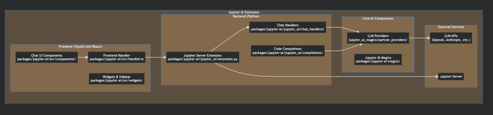

## Project Structure Breakdown

The Jupyter AI extension is organized as a **monorepo** with multiple packages:

### 📁 Main Package Structure

```
packages/
├── jupyter-ai/              # Main extension (frontend + backend)
├── jupyter-ai-magics/       # Core AI functionality & LLM providers  
├── jupyter-ai-test/         # Testing utilities
└── jupyter-ai-module-cookiecutter/  # Template for custom providers
```

### 🎯 **jupyter-ai** (Main Package)
This is the core extension that users install. It contains:

**Frontend (TypeScript/React):**
- `src/components/` - React components for the chat interface
- `src/handler.ts` - Main frontend handler for server communication
- `src/widgets/` - JupyterLab widgets and sidebar integration

**Backend (Python):**
- `jupyter_ai/extension.py` - Jupyter server extension entry point
- `jupyter_ai/chat_handlers/` - Handles different types of chat commands
- `jupyter_ai/completions/` - Code completion functionality
- `jupyter_ai/config_manager.py` - Configuration management

### 🧙‍♂️ **jupyter-ai-magics** (AI Core)
This package contains the actual AI functionality:
- `partner_providers/` - Integration with different LLM APIs (OpenAI, Anthropic, etc.)
- `magics.py` - Jupyter magic commands (`%%ai`, `%ai`)
- `base_provider.py` - Abstract base for all LLM providers

## Key Architecture Concepts

1. **Extension Pattern**: Follows JupyterLab's extension architecture
2. **Handler Pattern**: Uses handlers for different types of requests
3. **Provider Pattern**: Abstracts different LLM services behind a common interface
4. **Magic Commands**: Leverages Jupyter's magic command system

The extension works by:
1. **Frontend** provides the chat UI in JupyterLab's sidebar
2. **Backend** handles requests and communicates with LLM providers
3. **Magics** allow direct AI commands in notebook cells

This is a **real-time chat system** where the frontend sends messages to the backend, which then streams responses from LLM providers back to the UI.

What would you like me to explain next? I can dive deeper into:
- How the frontend and backend are separated and communicate
- The specific file organization within each package
- How this integrates with JupyterLab's architecture

Just say "next" to continue with frontend vs backend, or ask specific questions!

```plaintext
packages/
├── jupyter-ai/              # Main extension (frontend + backend)
├── jupyter-ai-magics/       # Core AI functionality & LLM providers  
├── jupyter-ai-test/         # Testing utilities
└── jupyter-ai-module-cookiecutter/  # Template for custom providers
```

---

**User**

focus on  jupyter-ai , move to next step

---

**Cursor**

# Step 2: Frontend vs Backend Code Organization

Let me show you how the `jupyter-ai` package is organized and how the frontend/backend separation works.

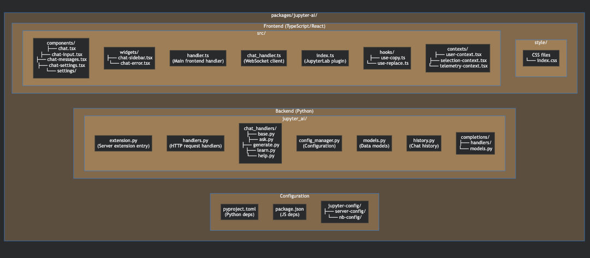

## Frontend Code Organization

Let me examine the key frontend files to show you how they're structured:

Now let me look at the backend structure:

Perfect! Now I can show you the clear separation between frontend and backend:

## 🎯 Frontend vs Backend Separation

### **Frontend (TypeScript/React) - `src/`**

```typescript
// Entry point - JupyterLab Plugin
src/index.ts                  // Main plugin registration & initialization
├── plugins/menu-plugin.ts    // Menu integration
└── tokens.ts                 // TypeScript interfaces

// Core Communication
src/handler.ts                // HTTP API client (REST requests)
src/chat_handler.ts           // WebSocket client (real-time chat)

// UI Components  
src/components/
├── chat.tsx                  // Main chat interface
├── chat-input.tsx            // Message input component
├── chat-messages.tsx         // Message display
├── chat-settings.tsx         // Settings panel
└── settings/                 // Configuration UI

// Widgets & Integration
src/widgets/
├── chat-sidebar.tsx          // JupyterLab sidebar integration
└── chat-error.tsx            // Error display widget

// State Management & Hooks
src/contexts/                 // React contexts for global state
src/hooks/                    // Custom React hooks
```

### **Backend (Python) - `jupyter_ai/`**

```python
# Server Extension Entry Point
extension.py                  # Jupyter server extension setup
handlers.py                   # HTTP API endpoints (REST handlers)

# Chat System
chat_handlers/                # Slash command implementations
├── base.py                   # Base chat handler
├── ask.py                    # /ask command
├── generate.py               # /generate command  
├── learn.py                  # /learn command
└── help.py                   # /help command

# Core Services
config_manager.py             # Configuration management
models.py                     # Data models (Pydantic)
history.py                    # Chat history storage
chat_sessions_manager.py      # Session management

# AI Integration
completions/                  # Code completion feature
context_providers/            # Context for AI responses
```

## 🔗 How They Connect

**1. Plugin Registration (index.ts):**
```typescript
// This is how the frontend registers with JupyterLab
const plugin: JupyterFrontEndPlugin<IJaiCore> = {
  id: '@jupyter-ai/core:plugin',
  autoStart: true,
  activate: async (app: JupyterFrontEnd) => {
    // Initialize WebSocket connection
    const chatHandler = new ChatHandler();
    await chatHandler.initialize();
    
    // Create chat UI widget
    const chatWidget = buildChatSidebar(...);
    app.shell.add(chatWidget, 'right');
  }
};
```

**2. Server Extension Registration (extension.py):**
```python
class AiExtension(ExtensionApp):
    """Jupyter Server extension for AI functionality"""
    
    def initialize_handlers(self):
        # REST API endpoints
        self.handlers.extend([
            (r"api/ai/config", GlobalConfigHandler),
            (r"api/ai/chats", RootChatHandler),  # WebSocket endpoint
            (r"api/ai/providers", ModelProviderHandler),
        ])
```

## 💡 Key Architecture Points for JavaScript Developers:

1. **Similar to Express.js**: The backend uses **Tornado** (Python's equivalent to Express) for HTTP routing
2. **WebSocket Pattern**: Real-time chat uses WebSocket connections (like Socket.io in Node.js)
3. **Component Architecture**: Frontend uses React components just like any React app
4. **API Layer**: Clean separation with REST APIs for configuration, WebSocket for chat
5. **State Management**: Uses React contexts instead of Redux/Zustand

This follows the **client-server architecture** you're familiar with, but integrated into JupyterLab's plugin system.

What would you like to explore next? The network communication layer (HTTP + WebSocket) would be a great next step, or we can dive deeper into any specific part!

```typescript
// Entry point - JupyterLab Plugin
src/index.ts                  // Main plugin registration & initialization
├── plugins/menu-plugin.ts    // Menu integration
└── tokens.ts                 // TypeScript interfaces

// Core Communication
src/handler.ts                // HTTP API client (REST requests)
src/chat_handler.ts           // WebSocket client (real-time chat)

// UI Components  
src/components/
├── chat.tsx                  // Main chat interface
├── chat-input.tsx            // Message input component
├── chat-messages.tsx         // Message display
├── chat-settings.tsx         // Settings panel
└── settings/                 // Configuration UI

// Widgets & Integration
src/widgets/
├── chat-sidebar.tsx          // JupyterLab sidebar integration
└── chat-error.tsx            // Error display widget

// State Management & Hooks
src/contexts/                 // React contexts for global state
src/hooks/                    // Custom React hooks
```

```python
# Server Extension Entry Point
extension.py                  # Jupyter server extension setup
handlers.py                   # HTTP API endpoints (REST handlers)

# Chat System
chat_handlers/                # Slash command implementations
├── base.py                   # Base chat handler
├── ask.py                    # /ask command
├── generate.py               # /generate command  
├── learn.py                  # /learn command
└── help.py                   # /help command

# Core Services
config_manager.py             # Configuration management
models.py                     # Data models (Pydantic)
history.py                    # Chat history storage
chat_sessions_manager.py      # Session management

# AI Integration
completions/                  # Code completion feature
context_providers/            # Context for AI responses
```

```typescript
// This is how the frontend registers with JupyterLab
const plugin: JupyterFrontEndPlugin<IJaiCore> = {
  id: '@jupyter-ai/core:plugin',
  autoStart: true,
  activate: async (app: JupyterFrontEnd) => {
    // Initialize WebSocket connection
    const chatHandler = new ChatHandler();
    await chatHandler.initialize();
    
    // Create chat UI widget
    const chatWidget = buildChatSidebar(...);
    app.shell.add(chatWidget, 'right');
  }
};
```

```python
class AiExtension(ExtensionApp):
    """Jupyter Server extension for AI functionality"""
    
    def initialize_handlers(self):
        # REST API endpoints
        self.handlers.extend([
            (r"api/ai/config", GlobalConfigHandler),
            (r"api/ai/chats", RootChatHandler),  # WebSocket endpoint
            (r"api/ai/providers", ModelProviderHandler),
        ])
```

---

**User**

next

---

**Cursor**

# Step 3: Network Communication (HTTP + WebSocket) Architecture

Let me show you how the frontend and backend communicate. There are **two communication channels**: HTTP for configuration/state, and WebSocket for real-time chat.

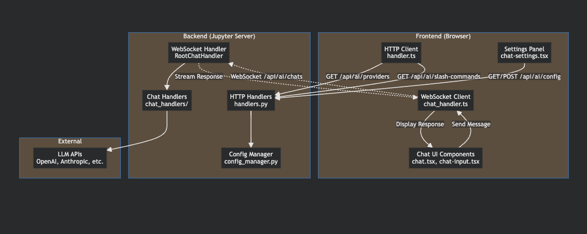

Let me examine the communication layers in detail:

Now let me look at the WebSocket handler:

Perfect! Now I can explain the complete network communication architecture:

## 🌐 Network Communication Architecture

### **1. HTTP Communication (REST API)**

The frontend uses **HTTP requests** for configuration and metadata:

```typescript
// Frontend: handler.ts - HTTP Client
const API_NAMESPACE = 'api/ai';

export async function requestAPI<T>(
  endPoint = '',
  init: RequestInit = {}
): Promise<T> {
  const settings = ServerConnection.makeSettings();
  const requestUrl = URLExt.join(settings.baseUrl, API_NAMESPACE, endPoint);
  
  const response = await ServerConnection.makeRequest(requestUrl, init, settings);
  return await response.json();
}
```

**HTTP Endpoints (Backend handlers.py):**
```python
# Configuration Management
/api/ai/config                 # GlobalConfigHandler - GET/POST config
/api/ai/providers              # ModelProviderHandler - GET available models  
/api/ai/slash-commands         # SlashCommandsInfoHandler - GET available commands
/api/ai/api-keys              # ApiKeysHandler - POST API keys
/api/ai/autocomplete-options  # AutocompleteOptionsHandler - GET contexts
/api/ai/sessions              # ChatSessionsHandler - manage chat sessions
```

### **2. WebSocket Communication (Real-time Chat)**

For **real-time chat**, the system uses WebSocket:

```typescript
// Frontend: chat_handler.ts - WebSocket Client
export class ChatHandler {
  private _socket: WebSocket | null = null;
  
  public async initialize(): Promise<void> {
    const url = new URL('/api/ai/chats', settings.wsUrl);
    this._socket = new WebSocket(url.href);
    
    this._socket.onmessage = event => {
      const message = JSON.parse(event.data);
      this._onMessage(message);
    };
  }
  
  public sendMessage(message: AiService.Request): Promise<string> {
    this._socket?.send(JSON.stringify(message));
  }
}
```

```python
# Backend: handlers.py - WebSocket Server
class RootChatHandler(JupyterHandler, websocket.WebSocketHandler):
    def open(self):
        """Handle WebSocket connection opening"""
        self.client_id = self.generate_client_id()
        
        # Send connection acknowledgment
        self.write_message({
            "type": "connection",
            "client_id": self.client_id
        })
    
    def on_message(self, message):
        """Handle incoming WebSocket messages"""
        data = json.loads(message)
        
        # Route to appropriate chat handler based on command
        if data.type == "chat":
            self.route_human_message(data)
```

## 🔄 Message Flow Diagram

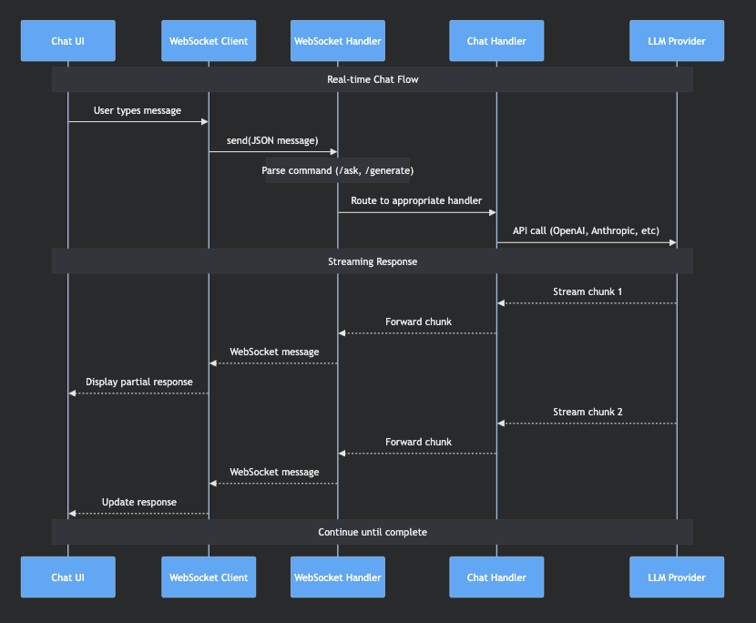

```typescript
// Frontend: handler.ts - HTTP Client
const API_NAMESPACE = 'api/ai';

export async function requestAPI<T>(
  endPoint = '',
  init: RequestInit = {}
): Promise<T> {
  const settings = ServerConnection.makeSettings();
  const requestUrl = URLExt.join(settings.baseUrl, API_NAMESPACE, endPoint);
  
  const response = await ServerConnection.makeRequest(requestUrl, init, settings);
  return await response.json();
}
```

```python
# Configuration Management
/api/ai/config                 # GlobalConfigHandler - GET/POST config
/api/ai/providers              # ModelProviderHandler - GET available models  
/api/ai/slash-commands         # SlashCommandsInfoHandler - GET available commands
/api/ai/api-keys              # ApiKeysHandler - POST API keys
/api/ai/autocomplete-options  # AutocompleteOptionsHandler - GET contexts
/api/ai/sessions              # ChatSessionsHandler - manage chat sessions
```

```typescript
// Frontend: chat_handler.ts - WebSocket Client
export class ChatHandler {
  private _socket: WebSocket | null = null;
  
  public async initialize(): Promise<void> {
    const url = new URL('/api/ai/chats', settings.wsUrl);
    this._socket = new WebSocket(url.href);
    
    this._socket.onmessage = event => {
      const message = JSON.parse(event.data);
      this._onMessage(message);
    };
  }
  
  public sendMessage(message: AiService.Request): Promise<string> {
    this._socket?.send(JSON.stringify(message));
  }
}
```

```python
# Backend: handlers.py - WebSocket Server
class RootChatHandler(JupyterHandler, websocket.WebSocketHandler):
    def open(self):
        """Handle WebSocket connection opening"""
        self.client_id = self.generate_client_id()
        
        # Send connection acknowledgment
        self.write_message({
            "type": "connection",
            "client_id": self.client_id
        })
    
    def on_message(self, message):
        """Handle incoming WebSocket messages"""
        data = json.loads(message)
        
        # Route to appropriate chat handler based on command
        if data.type == "chat":
            self.route_human_message(data)
```

## 🛠️ Key Communication Patterns

### **HTTP Pattern (Configuration)**
Think of this like **Express.js REST endpoints**:

```typescript
// Frontend calls (similar to fetch/axios)
const config = await requestAPI('config');           // GET /api/ai/config
const providers = await requestAPI('providers');     // GET /api/ai/providers
await requestAPI('config', { method: 'POST', body }); // POST /api/ai/config
```

### **WebSocket Pattern (Real-time Chat)**
Similar to **Socket.io**, but using native WebSocket:

```typescript
// Frontend sends message
chatHandler.sendMessage({
  type: "chat",
  body: "/ask What is Python?",
  selection: null
});

// Backend processes and streams response
{
  "type": "agent-stream",
  "id": "msg-123",
  "reply_to": "human-msg-456",
  "body": "Python is a programming language..."
}
```

## 🔍 Message Types

The WebSocket uses **typed messages** (defined in `models.py`):

```python
# Human messages (user input)
class HumanChatMessage:
    type: Literal["human"] = "human"
    body: str                    # User's message
    selection: Optional[dict]    # Selected code/text
    
# Agent responses (AI output)  
class AgentChatMessage:
    type: Literal["agent"] = "agent"
    body: str                    # AI response
    reply_to: str               # ID of human message
    
# Streaming chunks
class AgentStreamChunkMessage:
    type: Literal["agent-stream"] = "agent-stream"
    id: str
    chunk: str                  # Partial response
```

## 🎯 Why This Architecture?

1. **HTTP for State**: Configuration, settings, available models
2. **WebSocket for Chat**: Real-time streaming responses from LLMs
3. **Separation of Concerns**: UI state vs real-time communication
4. **Scalability**: Multiple clients can connect via WebSocket

This is very similar to modern chat applications like Discord or Slack - HTTP for metadata, WebSocket for real-time messages!

What would you like to explore next? The LLM integration and provider system would show you how the backend actually talks to AI services, or we can dive into slash commands!

```typescript
// Frontend calls (similar to fetch/axios)
const config = await requestAPI('config');           // GET /api/ai/config
const providers = await requestAPI('providers');     // GET /api/ai/providers
await requestAPI('config', { method: 'POST', body }); // POST /api/ai/config
```

```typescript
// Frontend sends message
chatHandler.sendMessage({
  type: "chat",
  body: "/ask What is Python?",
  selection: null
});

// Backend processes and streams response
{
  "type": "agent-stream",
  "id": "msg-123",
  "reply_to": "human-msg-456",
  "body": "Python is a programming language..."
}
```

```python
# Human messages (user input)
class HumanChatMessage:
    type: Literal["human"] = "human"
    body: str                    # User's message
    selection: Optional[dict]    # Selected code/text
    
# Agent responses (AI output)  
class AgentChatMessage:
    type: Literal["agent"] = "agent"
    body: str                    # AI response
    reply_to: str               # ID of human message
    
# Streaming chunks
class AgentStreamChunkMessage:
    type: Literal["agent-stream"] = "agent-stream"
    id: str
    chunk: str                  # Partial response
```

```typescript
// Frontend calls (similar to fetch/axios)
const config = await requestAPI('config');           // GET /api/ai/config
const providers = await requestAPI('providers');     // GET /api/ai/providers
await requestAPI('config', { method: 'POST', body }); // POST /api/ai/config
```

```typescript
// Frontend sends message
chatHandler.sendMessage({
  type: "chat",
  body: "/ask What is Python?",
  selection: null
});

// Backend processes and streams response
{
  "type": "agent-stream",
  "id": "msg-123",
  "reply_to": "human-msg-456",
  "body": "Python is a programming language..."
}
```

```python
# Human messages (user input)
class HumanChatMessage:
    type: Literal["human"] = "human"
    body: str                    # User's message
    selection: Optional[dict]    # Selected code/text
    
# Agent responses (AI output)  
class AgentChatMessage:
    type: Literal["agent"] = "agent"
    body: str                    # AI response
    reply_to: str               # ID of human message
    
# Streaming chunks
class AgentStreamChunkMessage:
    type: Literal["agent-stream"] = "agent-stream"
    id: str
    chunk: str                  # Partial response
```

---

**User**

next

---

**Cursor**

# Step 4: LLM Integration and Provider System

Now let's dive into how Jupyter AI actually integrates with different LLM services. This is where the magic happens!

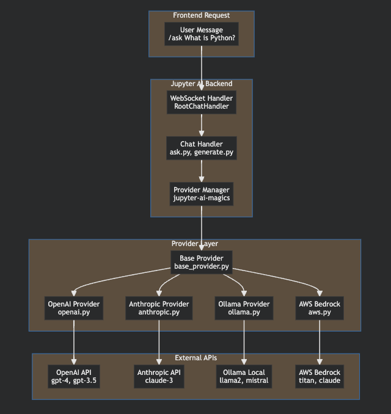

Let me explore the provider system architecture:

Now let me see how providers are used in the chat handlers:

Let me look at how providers are discovered and configured:

Perfect! Now I have a complete picture. Let me show you how the LLM integration works:

## 🤖 LLM Integration and Provider System

### **1. Provider Architecture Pattern**

Jupyter AI uses the **Strategy Pattern** to support multiple LLM providers. Think of it like a plugin system:

```python
# Base Provider (Abstract Interface)
class BaseProvider:
    id: str           # e.g., "openai-chat"
    name: str         # e.g., "OpenAI"
    models: list      # e.g., ["gpt-4", "gpt-3.5-turbo"]
    auth_strategy     # How to authenticate
    
    def create_llm_chain(self) -> Runnable:
        """Create a LangChain runnable for this provider"""
        pass
```

### **2. Concrete Provider Implementations**

Each LLM service has its own provider class:

```python
# OpenAI Provider
class ChatOpenAIProvider(BaseProvider, ChatOpenAI):
    id = "openai-chat"
    name = "OpenAI" 
    models = ["gpt-4", "gpt-4-turbo", "gpt-3.5-turbo"]
    auth_strategy = EnvAuthStrategy(name="OPENAI_API_KEY")

# Anthropic Provider  
class AnthropicProvider(BaseProvider, ChatAnthropic):
    id = "anthropic-chat"
    name = "Anthropic"
    models = ["claude-3-opus-20240229", "claude-3-sonnet-20240229"]
    auth_strategy = EnvAuthStrategy(name="ANTHROPIC_API_KEY")

# Local Ollama Provider
class OllamaProvider(BaseProvider, ChatOllama):
    id = "ollama-chat"
    name = "Ollama"
    models = ["llama2", "mistral", "codellama"]
    # No auth needed for local
```

### **3. Provider Discovery System**

Uses **Python entry points** (like npm packages) for plugin discovery:

```python
def get_lm_providers() -> dict[str, BaseProvider]:
    """Discover all available LLM providers via entry points"""
    providers = {}
    eps = entry_points()
    
    # Look for providers in the 'jupyter_ai.model_providers' group
    provider_group = eps.select(group="jupyter_ai.model_providers")
    
    for provider_ep in provider_group:
        try:
            provider = provider_ep.load()  # Import the provider class
            providers[provider.id] = provider
        except ImportError as e:
            log.warning(f"Provider {provider_ep.name} requires {e.name} package")
    
    return providers
```

**Entry Points Configuration** (in `pyproject.toml`):
```toml
[project.entry-points."jupyter_ai.model_providers"]
openai-chat = "jupyter_ai_magics.partner_providers.openai:ChatOpenAIProvider"
anthropic-chat = "jupyter_ai_magics.partner_providers.anthropic:ChatAnthropicProvider"
ollama-chat = "jupyter_ai_magics.partner_providers.ollama:ChatOllamaProvider"
```

### **4. How Chat Handlers Use Providers**

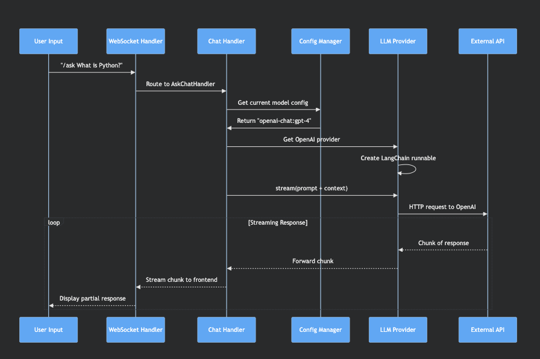

```python
# Base Provider (Abstract Interface)
class BaseProvider:
    id: str           # e.g., "openai-chat"
    name: str         # e.g., "OpenAI"
    models: list      # e.g., ["gpt-4", "gpt-3.5-turbo"]
    auth_strategy     # How to authenticate
    
    def create_llm_chain(self) -> Runnable:
        """Create a LangChain runnable for this provider"""
        pass
```

```python
# OpenAI Provider
class ChatOpenAIProvider(BaseProvider, ChatOpenAI):
    id = "openai-chat"
    name = "OpenAI" 
    models = ["gpt-4", "gpt-4-turbo", "gpt-3.5-turbo"]
    auth_strategy = EnvAuthStrategy(name="OPENAI_API_KEY")

# Anthropic Provider  
class AnthropicProvider(BaseProvider, ChatAnthropic):
    id = "anthropic-chat"
    name = "Anthropic"
    models = ["claude-3-opus-20240229", "claude-3-sonnet-20240229"]
    auth_strategy = EnvAuthStrategy(name="ANTHROPIC_API_KEY")

# Local Ollama Provider
class OllamaProvider(BaseProvider, ChatOllama):
    id = "ollama-chat"
    name = "Ollama"
    models = ["llama2", "mistral", "codellama"]
    # No auth needed for local
```

```python
def get_lm_providers() -> dict[str, BaseProvider]:
    """Discover all available LLM providers via entry points"""
    providers = {}
    eps = entry_points()
    
    # Look for providers in the 'jupyter_ai.model_providers' group
    provider_group = eps.select(group="jupyter_ai.model_providers")
    
    for provider_ep in provider_group:
        try:
            provider = provider_ep.load()  # Import the provider class
            providers[provider.id] = provider
        except ImportError as e:
            log.warning(f"Provider {provider_ep.name} requires {e.name} package")
    
    return providers
```

```toml
[project.entry-points."jupyter_ai.model_providers"]
openai-chat = "jupyter_ai_magics.partner_providers.openai:ChatOpenAIProvider"
anthropic-chat = "jupyter_ai_magics.partner_providers.anthropic:ChatAnthropicProvider"
ollama-chat = "jupyter_ai_magics.partner_providers.ollama:ChatOllamaProvider"
```

Here's how it works in the chat handlers:

```python
# In chat_handlers/base.py
class BaseChatHandler:
    def __init__(self, config_manager: ConfigManager, **kwargs):
        self.config_manager = config_manager
        
    @property  
    def llm_chain(self) -> Optional[Runnable]:
        """Get the current LLM chain based on config"""
        config = self.config_manager.config
        
        # Get the configured model (e.g., "openai-chat:gpt-4")
        model_id = config.model_provider_id
        if not model_id:
            return None
            
        # Parse provider and model
        provider_id, local_model_id = model_id.split(":")
        
        # Get the provider instance
        providers = get_lm_providers()
        provider_class = providers[provider_id]
        
        # Create provider instance with config
        provider = provider_class(
            model=local_model_id,
            **config.fields  # API keys, etc.
        )
        
        # Return LangChain runnable
        return provider.create_llm_chain()
```

### **5. Streaming Response Flow**

The magic happens with **async streaming**:

```python
# In chat_handlers/ask.py
class AskChatHandler(BaseChatHandler):
    async def process_message(self, message: HumanChatMessage):
        # Get the LLM chain for current provider
        llm_chain = self.llm_chain
        
        # Create input with context and chat history
        chain_input = {
            "input": message.body,
            "context": self.get_context(),
            "chat_history": self.get_history()
        }
        
        # Stream the response
        async for chunk in llm_chain.astream(chain_input):
            # Send each chunk immediately to frontend
            self.reply(AgentStreamChunkMessage(
                type="agent-stream",
                id=message.id,
                chunk=chunk.content
            ))
```

### **6. Configuration & Model Selection**

The system supports **dynamic model switching**:

```json
// Current configuration
{
  "model_provider_id": "openai-chat:gpt-4",
  "api_keys": {
    "OPENAI_API_KEY": "sk-..."
  },
  "model_parameters": {
    "temperature": 0.7,
    "max_tokens": 1000
  }
}
```

Users can switch models via the UI:
- **Frontend**: Settings panel shows available providers and models
- **Backend**: Config manager validates and applies changes
- **Real-time**: Next message uses the new model

### **7. Key Benefits of This Architecture**

1. **Extensible**: Add new providers without changing core code
2. **Swappable**: Switch between OpenAI, Anthropic, local models seamlessly  
3. **Configurable**: Each provider can have different settings
4. **Streaming**: All providers support real-time streaming responses
5. **Error Handling**: Provider-specific error detection and handling

This is similar to how modern frameworks handle plugins - **dependency injection** + **strategy pattern** + **entry points for discovery**.

What would you like to explore next? Slash commands would show you how different chat commands are implemented, or we can dive into the key files and their specific roles!

```python
# In chat_handlers/base.py
class BaseChatHandler:
    def __init__(self, config_manager: ConfigManager, **kwargs):
        self.config_manager = config_manager
        
    @property  
    def llm_chain(self) -> Optional[Runnable]:
        """Get the current LLM chain based on config"""
        config = self.config_manager.config
        
        # Get the configured model (e.g., "openai-chat:gpt-4")
        model_id = config.model_provider_id
        if not model_id:
            return None
            
        # Parse provider and model
        provider_id, local_model_id = model_id.split(":")
        
        # Get the provider instance
        providers = get_lm_providers()
        provider_class = providers[provider_id]
        
        # Create provider instance with config
        provider = provider_class(
            model=local_model_id,
            **config.fields  # API keys, etc.
        )
        
        # Return LangChain runnable
        return provider.create_llm_chain()
```

```python
# In chat_handlers/ask.py
class AskChatHandler(BaseChatHandler):
    async def process_message(self, message: HumanChatMessage):
        # Get the LLM chain for current provider
        llm_chain = self.llm_chain
        
        # Create input with context and chat history
        chain_input = {
            "input": message.body,
            "context": self.get_context(),
            "chat_history": self.get_history()
        }
        
        # Stream the response
        async for chunk in llm_chain.astream(chain_input):
            # Send each chunk immediately to frontend
            self.reply(AgentStreamChunkMessage(
                type="agent-stream",
                id=message.id,
                chunk=chunk.content
            ))
```

```json
// Current configuration
{
  "model_provider_id": "openai-chat:gpt-4",
  "api_keys": {
    "OPENAI_API_KEY": "sk-..."
  },
  "model_parameters": {
    "temperature": 0.7,
    "max_tokens": 1000
  }
}
```

```python
# In chat_handlers/base.py
class BaseChatHandler:
    def __init__(self, config_manager: ConfigManager, **kwargs):
        self.config_manager = config_manager
        
    @property  
    def llm_chain(self) -> Optional[Runnable]:
        """Get the current LLM chain based on config"""
        config = self.config_manager.config
        
        # Get the configured model (e.g., "openai-chat:gpt-4")
        model_id = config.model_provider_id
        if not model_id:
            return None
            
        # Parse provider and model
        provider_id, local_model_id = model_id.split(":")
        
        # Get the provider instance
        providers = get_lm_providers()
        provider_class = providers[provider_id]
        
        # Create provider instance with config
        provider = provider_class(
            model=local_model_id,
            **config.fields  # API keys, etc.
        )
        
        # Return LangChain runnable
        return provider.create_llm_chain()
```

```python
# In chat_handlers/ask.py
class AskChatHandler(BaseChatHandler):
    async def process_message(self, message: HumanChatMessage):
        # Get the LLM chain for current provider
        llm_chain = self.llm_chain
        
        # Create input with context and chat history
        chain_input = {
            "input": message.body,
            "context": self.get_context(),
            "chat_history": self.get_history()
        }
        
        # Stream the response
        async for chunk in llm_chain.astream(chain_input):
            # Send each chunk immediately to frontend
            self.reply(AgentStreamChunkMessage(
                type="agent-stream",
                id=message.id,
                chunk=chunk.content
            ))
```

```json
// Current configuration
{
  "model_provider_id": "openai-chat:gpt-4",
  "api_keys": {
    "OPENAI_API_KEY": "sk-..."
  },
  "model_parameters": {
    "temperature": 0.7,
    "max_tokens": 1000
  }
}
```

---

**User**

Does on every new message a new LLm instance is created?

---

**Cursor**

Great question! Let me investigate how LLM instances are managed and whether they're created fresh for each message.

Now let me look at the `get_llm_chain()` method more closely:

Perfect! Now I can give you a clear answer about LLM instance lifecycle.

## 🔄 LLM Instance Lifecycle: **NO**, New Instances Are NOT Created Per Message

The system is **much smarter** than that! Here's how it actually works:

### **1. Instance Caching & Reuse**

```python
class BaseChatHandler:
    def __init__(self):
        # These are instance variables that persist across messages
        self.llm: Optional[BaseProvider] = None          # Cached LLM instance
        self.llm_params: Optional[dict] = None           # Last used parameters  
        self.llm_chain: Optional[Runnable] = None        # Cached chain
        
    def get_llm_chain(self):
        """Smart caching logic - only recreates when necessary"""
        lm_provider = self.config_manager.lm_provider
        lm_provider_params = self.config_manager.lm_provider_params
        
        # Check if model changed (e.g., gpt-4 → claude-3)
        curr_lm_id = f'{self.llm.id}:{self.llm_params["model_id"]}' if self.llm else None
        next_lm_id = f'{lm_provider.id}:{lm_provider_params["model_id"]}'
        
        # Only recreate if model OR parameters changed
        if curr_lm_id != next_lm_id:
            self.log.info(f"Switching model from {curr_lm_id} to {next_lm_id}")
            self.create_llm_chain(lm_provider, lm_provider_params)  # New instance
        elif self.llm_params != lm_provider_params:
            self.log.info("Model params changed, updating chain")
            self.create_llm_chain(lm_provider, lm_provider_params)  # New instance
        
        # Otherwise, reuse existing instance!
        return self.llm_chain
```

### **2. When New Instances ARE Created**

New LLM instances are created only when:

1. **Model Changes**: `openai-chat:gpt-4` → `anthropic-chat:claude-3`
2. **Parameters Change**: `temperature: 0.7` → `temperature: 0.9`
3. **First Message**: No existing instance
4. **Handler Switch**: Different chat handlers have separate instances

```python
# Message 1: Creates new instance
user: "Hello"  # → Creates openai-chat:gpt-4 instance

# Message 2-100: Reuses same instance  
user: "What is Python?"  # → Reuses existing instance
user: "Tell me more"     # → Reuses existing instance
user: "Another question" # → Reuses existing instance

# Message 101: User changes model in settings
user: "Use Claude now"   # → Creates new anthropic-chat:claude-3 instance

# Message 102+: Reuses Claude instance
user: "More questions"   # → Reuses Claude instance
```

### **3. Per-Handler Instance Management**

Each **chat handler** maintains its own LLM instance:

```python
# Different handlers, different instances
ask_handler.llm_chain      # Instance for /ask commands
generate_handler.llm_chain # Instance for /generate commands  
default_handler.llm_chain  # Instance for general chat
fix_handler.llm_chain      # Instance for /fix commands
```

### **4. Memory & Performance Benefits**

This design provides:

**✅ Performance**: No expensive instance creation per message
**✅ Memory**: Reuses connection pools, tokenizers, model weights
**✅ State**: Maintains conversation context efficiently
**✅ Flexibility**: Easy model switching when needed

### **5. Practical Example**

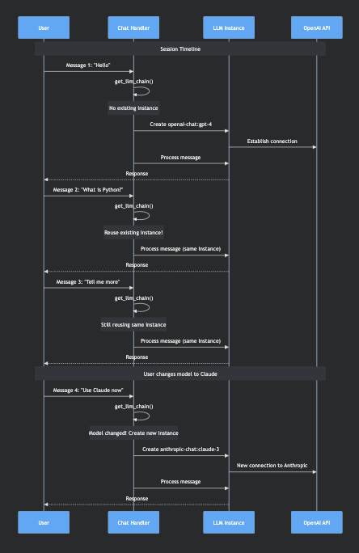

```python
class BaseChatHandler:
    def __init__(self):
        # These are instance variables that persist across messages
        self.llm: Optional[BaseProvider] = None          # Cached LLM instance
        self.llm_params: Optional[dict] = None           # Last used parameters  
        self.llm_chain: Optional[Runnable] = None        # Cached chain
        
    def get_llm_chain(self):
        """Smart caching logic - only recreates when necessary"""
        lm_provider = self.config_manager.lm_provider
        lm_provider_params = self.config_manager.lm_provider_params
        
        # Check if model changed (e.g., gpt-4 → claude-3)
        curr_lm_id = f'{self.llm.id}:{self.llm_params["model_id"]}' if self.llm else None
        next_lm_id = f'{lm_provider.id}:{lm_provider_params["model_id"]}'
        
        # Only recreate if model OR parameters changed
        if curr_lm_id != next_lm_id:
            self.log.info(f"Switching model from {curr_lm_id} to {next_lm_id}")
            self.create_llm_chain(lm_provider, lm_provider_params)  # New instance
        elif self.llm_params != lm_provider_params:
            self.log.info("Model params changed, updating chain")
            self.create_llm_chain(lm_provider, lm_provider_params)  # New instance
        
        # Otherwise, reuse existing instance!
        return self.llm_chain
```

```python
# Message 1: Creates new instance
user: "Hello"  # → Creates openai-chat:gpt-4 instance

# Message 2-100: Reuses same instance  
user: "What is Python?"  # → Reuses existing instance
user: "Tell me more"     # → Reuses existing instance
user: "Another question" # → Reuses existing instance

# Message 101: User changes model in settings
user: "Use Claude now"   # → Creates new anthropic-chat:claude-3 instance

# Message 102+: Reuses Claude instance
user: "More questions"   # → Reuses Claude instance
```

```python
# Different handlers, different instances
ask_handler.llm_chain      # Instance for /ask commands
generate_handler.llm_chain # Instance for /generate commands  
default_handler.llm_chain  # Instance for general chat
fix_handler.llm_chain      # Instance for /fix commands
```

### **6. Code Evidence**

Here's the exact logic from the codebase:

```python
# In chat_handlers/base.py line 372-398
def get_llm_chain(self):
    # Get current config
    lm_provider = self.config_manager.lm_provider
    lm_provider_params = self.config_manager.lm_provider_params
    
    # Compare current vs next model IDs
    curr_lm_id = f'{self.llm.id}:{lm_provider_params["model_id"]}' if self.llm else None
    next_lm_id = f'{lm_provider.id}:{lm_provider_params["model_id"]}'
    
    # Only create new instance if something changed
    if curr_lm_id != next_lm_id:
        self.create_llm_chain(lm_provider, lm_provider_params)  # NEW INSTANCE
    elif self.llm_params != lm_provider_params:
        self.create_llm_chain(lm_provider, lm_provider_params)  # NEW INSTANCE
    
    # Otherwise return cached instance
    return self.llm_chain  # REUSED INSTANCE
```

So **no** - the system is designed for efficiency and only creates new LLM instances when absolutely necessary! This is a well-architected system that balances flexibility with performance.

```python
# In chat_handlers/base.py line 372-398
def get_llm_chain(self):
    # Get current config
    lm_provider = self.config_manager.lm_provider
    lm_provider_params = self.config_manager.lm_provider_params
    
    # Compare current vs next model IDs
    curr_lm_id = f'{self.llm.id}:{lm_provider_params["model_id"]}' if self.llm else None
    next_lm_id = f'{lm_provider.id}:{lm_provider_params["model_id"]}'
    
    # Only create new instance if something changed
    if curr_lm_id != next_lm_id:
        self.create_llm_chain(lm_provider, lm_provider_params)  # NEW INSTANCE
    elif self.llm_params != lm_provider_params:
        self.create_llm_chain(lm_provider, lm_provider_params)  # NEW INSTANCE
    
    # Otherwise return cached instance
    return self.llm_chain  # REUSED INSTANCE
```

```python
# In chat_handlers/base.py line 372-398
def get_llm_chain(self):
    # Get current config
    lm_provider = self.config_manager.lm_provider
    lm_provider_params = self.config_manager.lm_provider_params
    
    # Compare current vs next model IDs
    curr_lm_id = f'{self.llm.id}:{lm_provider_params["model_id"]}' if self.llm else None
    next_lm_id = f'{lm_provider.id}:{lm_provider_params["model_id"]}'
    
    # Only create new instance if something changed
    if curr_lm_id != next_lm_id:
        self.create_llm_chain(lm_provider, lm_provider_params)  # NEW INSTANCE
    elif self.llm_params != lm_provider_params:
        self.create_llm_chain(lm_provider, lm_provider_params)  # NEW INSTANCE
    
    # Otherwise return cached instance
    return self.llm_chain  # REUSED INSTANCE
```

---

**User**

If each handler has its own instance, wouldn’t that be a problem if I ask a question in normal chat and then use the /ask command? Since /ask uses a different handler, it would have a separate history/context and might treat my message as a fresh one.

---

**Cursor**

Excellent observation! You've identified a potential UX issue, but the system actually handles this quite cleverly. Let me show you how conversation context is managed across different handlers.

Let me examine how the conversation history is shared:

Now I understand the architecture! Let me show you how conversation context is actually shared across handlers:

## 🧠 Conversation Context is SHARED Across All Handlers!

You're absolutely right to be concerned about this, but the system is designed to **share conversation context** across all handlers. Here's how it works:

### **1. Shared Global Chat History**

All handlers receive the **same shared objects** during initialization:

```python
# In extension.py - ALL handlers get the same instances
self.settings["chat_history"] = []           # Shared UI chat history
self.settings["llm_chat_memory"] = BoundedChatHistory(k=2)  # Shared LLM memory

# Each handler gets these SAME shared instances
class BaseChatHandler:
    def __init__(self, 
                 chat_history: list[ChatMessage],        # SHARED across all handlers
                 llm_chat_memory: "BoundedChatHistory",  # SHARED across all handlers
                 **kwargs):
        self._chat_history = chat_history       # Same reference for all handlers
        self.llm_chat_memory = llm_chat_memory  # Same reference for all handlers
```

### **2. Two Types of History**

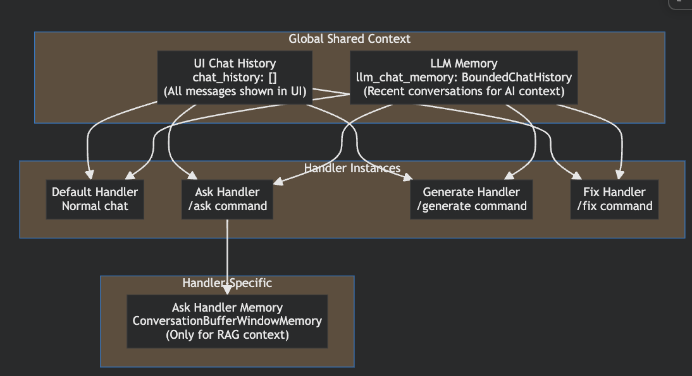

```python
# In extension.py - ALL handlers get the same instances
self.settings["chat_history"] = []           # Shared UI chat history
self.settings["llm_chat_memory"] = BoundedChatHistory(k=2)  # Shared LLM memory

# Each handler gets these SAME shared instances
class BaseChatHandler:
    def __init__(self, 
                 chat_history: list[ChatMessage],        # SHARED across all handlers
                 llm_chat_memory: "BoundedChatHistory",  # SHARED across all handlers
                 **kwargs):
        self._chat_history = chat_history       # Same reference for all handlers
        self.llm_chat_memory = llm_chat_memory  # Same reference for all handlers
```

### **3. How Context Flows Between Handlers**

Here's a concrete example:

```python
# User Session Flow
1. User: "What is Python?"                    # → Default Handler
   # Adds to shared chat_history + llm_chat_memory

2. User: "Tell me more about classes"         # → Default Handler  
   # Has access to previous "What is Python?" context

3. User: "/ask How do Python classes work?"   # → Ask Handler
   # STILL has access to both previous messages!
   # Plus uses learned documents for RAG
```

**Code Evidence:**

```python
# In default.py - Default handler uses shared memory
class DefaultChatHandler(BaseChatHandler):
    def create_llm_chain(self, provider, provider_params):
        runnable = prompt_template | llm | StrOutputParser()
        
        if not llm.manages_history:
            # Uses SHARED llm_chat_memory across all handlers
            runnable = RunnableWithMessageHistory(
                runnable=runnable,
                get_session_history=self.get_llm_chat_memory,  # SHARED memory
                input_messages_key="input",
                history_messages_key="history"
            )
```

### **4. Ask Handler Additional Context**

The `/ask` handler does have **additional** context, but it **doesn't lose** the shared context:

```python
# In ask.py - Ask handler has BOTH shared + RAG context
class AskChatHandler(BaseChatHandler):
    def create_llm_chain(self, provider, provider_params):
        self.llm = provider(**unified_parameters)
        
        # Additional memory for RAG (on top of shared memory)
        memory = ConversationBufferWindowMemory(
            memory_key="chat_history", 
            return_messages=True, 
            k=2  # Only recent exchanges for RAG efficiency
        )
        
        self.llm_chain = ConversationalRetrievalChain.from_llm(
            self.llm,
            self.retriever,  # Learned documents
            memory=memory,   # RAG-specific memory
            # Plus it still has access to shared context via self.llm_chat_memory
        )
```

### **5. Real Example Flow**

```python
# Session transcript
User: "I'm working on a data analysis project"           # Default handler
Bot: "Great! What kind of data are you analyzing?"

User: "Customer sales data. What tools should I use?"    # Default handler  
Bot: "For sales data analysis, I'd recommend pandas..."  # Knows about "data analysis project"

User: "/ask What are best practices for sales analysis?" # Ask handler
Bot: "Based on your previous mention of customer sales   # STILL knows the context!
      data analysis, here are best practices from the
      learned documents..."
```

### **6. Memory Architecture Summary**

```python
# SHARED across ALL handlers (same object references)
shared_chat_history = []           # UI display + persistence
shared_llm_memory = BoundedChatHistory(k=2)  # Recent conversation context

# Handler-specific enhancements
default_handler.llm_chain.memory = shared_llm_memory     # Uses shared memory directly
ask_handler.additional_memory = ConversationBufferWindowMemory(k=2)  # RAG-specific
generate_handler.llm_chain = ...  # Uses shared memory + generation context
```

## ✅ The Answer: Context is Preserved!

The system is **well-designed** to maintain conversation continuity:

1. **Shared Memory**: All handlers access the same conversation history
2. **Additive Context**: Specialized handlers (like `/ask`) add context, don't replace it
3. **Seamless Transitions**: You can switch between normal chat and slash commands smoothly
4. **UI Consistency**: The chat interface shows all messages regardless of handler

So when you ask "What is Python?" and then use "/ask Tell me more about classes", the `/ask` handler knows you were previously discussing Python! 

This is actually a sophisticated design that gives you the best of both worlds - unified conversation flow + specialized capabilities per command.

```python
# User Session Flow
1. User: "What is Python?"                    # → Default Handler
   # Adds to shared chat_history + llm_chat_memory

2. User: "Tell me more about classes"         # → Default Handler  
   # Has access to previous "What is Python?" context

3. User: "/ask How do Python classes work?"   # → Ask Handler
   # STILL has access to both previous messages!
   # Plus uses learned documents for RAG
```

```python
# User Session Flow
1. User: "What is Python?"                    # → Default Handler
   # Adds to shared chat_history + llm_chat_memory

2. User: "Tell me more about classes"         # → Default Handler  
   # Has access to previous "What is Python?" context

3. User: "/ask How do Python classes work?"   # → Ask Handler
   # STILL has access to both previous messages!
   # Plus uses learned documents for RAG
```

```python
# In default.py - Default handler uses shared memory
class DefaultChatHandler(BaseChatHandler):
    def create_llm_chain(self, provider, provider_params):
        runnable = prompt_template | llm | StrOutputParser()
        
        if not llm.manages_history:
            # Uses SHARED llm_chat_memory across all handlers
            runnable = RunnableWithMessageHistory(
                runnable=runnable,
                get_session_history=self.get_llm_chat_memory,  # SHARED memory
                input_messages_key="input",
                history_messages_key="history"
            )
```

```python
# In ask.py - Ask handler has BOTH shared + RAG context
class AskChatHandler(BaseChatHandler):
    def create_llm_chain(self, provider, provider_params):
        self.llm = provider(**unified_parameters)
        
        # Additional memory for RAG (on top of shared memory)
        memory = ConversationBufferWindowMemory(
            memory_key="chat_history", 
            return_messages=True, 
            k=2  # Only recent exchanges for RAG efficiency
        )
        
        self.llm_chain = ConversationalRetrievalChain.from_llm(
            self.llm,
            self.retriever,  # Learned documents
            memory=memory,   # RAG-specific memory
            # Plus it still has access to shared context via self.llm_chat_memory
        )
```

```python
# Session transcript
User: "I'm working on a data analysis project"           # Default handler
Bot: "Great! What kind of data are you analyzing?"

User: "Customer sales data. What tools should I use?"    # Default handler  
Bot: "For sales data analysis, I'd recommend pandas..."  # Knows about "data analysis project"

User: "/ask What are best practices for sales analysis?" # Ask handler
Bot: "Based on your previous mention of customer sales   # STILL knows the context!
      data analysis, here are best practices from the
      learned documents..."
```

```python
# SHARED across ALL handlers (same object references)
shared_chat_history = []           # UI display + persistence
shared_llm_memory = BoundedChatHistory(k=2)  # Recent conversation context

# Handler-specific enhancements
default_handler.llm_chain.memory = shared_llm_memory     # Uses shared memory directly
ask_handler.additional_memory = ConversationBufferWindowMemory(k=2)  # RAG-specific
generate_handler.llm_chain = ...  # Uses shared memory + generation context
```

---

**User**

next

---

**Cursor**

# Step 5: Slash Commands Implementation

Now let's dive into how slash commands work! This is where Jupyter AI's chat interface becomes really powerful with specialized commands like `/ask`, `/generate`, `/learn`, etc.

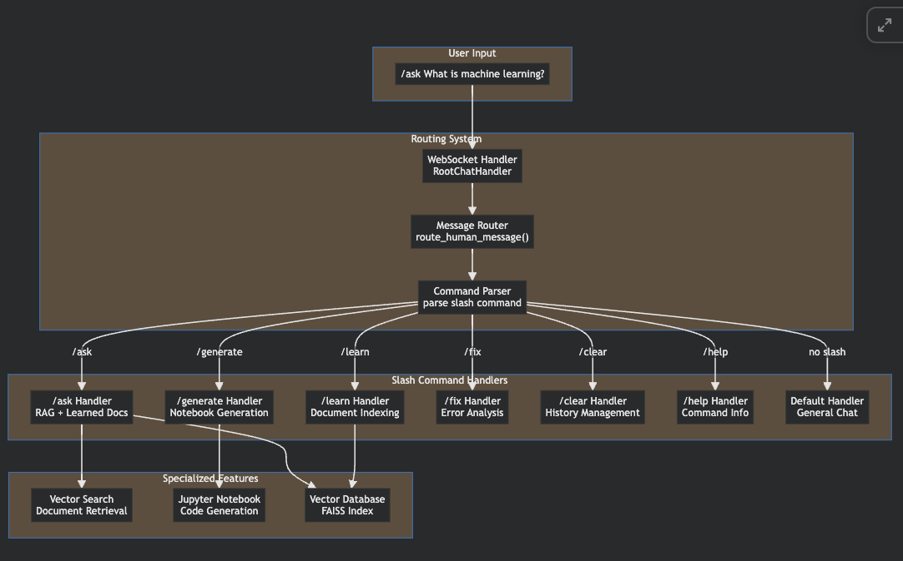

Let me examine how slash commands are implemented:

Let me find the routing logic:

Perfect! Now I found the routing logic. Let me examine the specific slash command handlers:

Now let me examine how handlers are registered and the complete slash command system:

Excellent! Now I have the complete picture. Let me show you how slash commands work:

## ⚡ Slash Commands Implementation

### **1. Command Routing Architecture**

The slash command system uses a **dispatcher pattern** that routes messages based on the command prefix:

```python
# In handlers.py - Main routing logic
async def _route(self, message):
    """Routes incoming message to appropriate handler"""
    default = self.chat_handlers["default"]
    
    # Parse the first word to check for slash command
    maybe_command = message.body.split(None, 1)[0]  # e.g., "/ask"
    
    is_command = (
        message.body.startswith("/")                    # Starts with /
        and maybe_command in self.chat_handlers.keys() # Command exists
        and maybe_command != "default"                  # Not default handler
    )
    
    command = maybe_command if is_command else "default"
    
    # Route to appropriate handler
    if is_command:
        await self.chat_handlers[command].on_message(message)  # e.g., "/ask" → AskChatHandler
    else:
        await default.on_message(message)                      # General chat → DefaultChatHandler
```

### **2. Handler Registration System**

Slash commands are registered via **Python entry points** (like plugins):

```python
# In pyproject.toml - Entry point registration
[project.entry-points."jupyter_ai.chat_handlers"]
ask = "jupyter_ai.chat_handlers:AskChatHandler"
generate = "jupyter_ai.chat_handlers:GenerateChatHandler" 
learn = "jupyter_ai.chat_handlers:LearnChatHandler"
fix = "jupyter_ai.chat_handlers:FixChatHandler"
clear = "jupyter_ai.chat_handlers:ClearChatHandler"
help = "jupyter_ai.chat_handlers:HelpChatHandler"
default = "jupyter_ai.chat_handlers:DefaultChatHandler"
export = "jupyter_ai.chat_handlers:ExportChatHandler"
```

### **3. Command Handler Base Class**

All slash commands inherit from `BaseChatHandler`:

```python
class BaseChatHandler:
    # Command metadata
    id: str                    # e.g., "ask", "generate"
    name: str                  # e.g., "Ask with Local Data"
    help: str                  # Description for help
    routing_type: SlashCommandRoutingType  # How to route to this handler
    uses_llm: bool = False     # Whether this command needs an LLM
    supports_help: bool = True # Whether -h/--help is supported
    
    def __init__(self, **kwargs):
        # All handlers get shared context
        self._chat_history = kwargs["chat_history"]
        self.llm_chat_memory = kwargs["llm_chat_memory"]
        self.config_manager = kwargs["config_manager"]
        
        # Argument parser for command-line style arguments
        self.parser = argparse.ArgumentParser(
            description=self.help,
            formatter_class=MarkdownHelpFormatter
        )
        
    async def process_message(self, message: HumanChatMessage):
        """Subclasses implement their specific logic here"""
        raise NotImplementedError
```

### **4. Available Slash Commands**

Let me show you the complete command catalog:

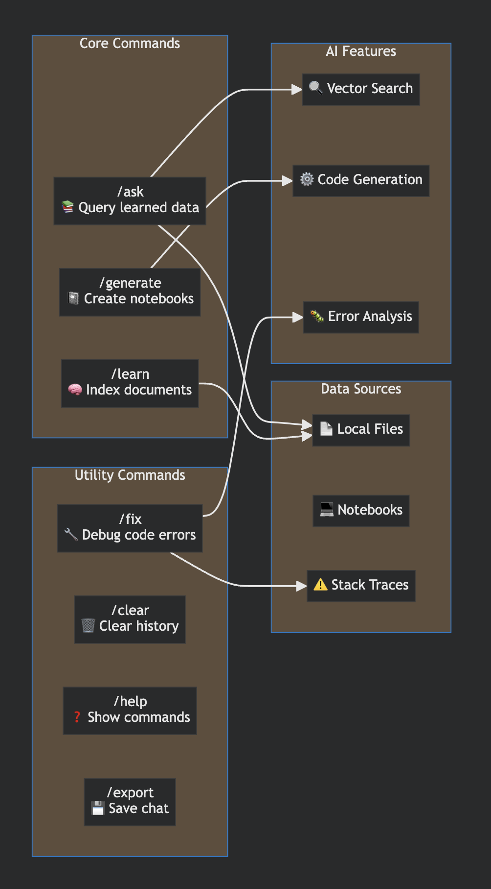

```python
# In handlers.py - Main routing logic
async def _route(self, message):
    """Routes incoming message to appropriate handler"""
    default = self.chat_handlers["default"]
    
    # Parse the first word to check for slash command
    maybe_command = message.body.split(None, 1)[0]  # e.g., "/ask"
    
    is_command = (
        message.body.startswith("/")                    # Starts with /
        and maybe_command in self.chat_handlers.keys() # Command exists
        and maybe_command != "default"                  # Not default handler
    )
    
    command = maybe_command if is_command else "default"
    
    # Route to appropriate handler
    if is_command:
        await self.chat_handlers[command].on_message(message)  # e.g., "/ask" → AskChatHandler
    else:
        await default.on_message(message)                      # General chat → DefaultChatHandler
```

```python
# In pyproject.toml - Entry point registration
[project.entry-points."jupyter_ai.chat_handlers"]
ask = "jupyter_ai.chat_handlers:AskChatHandler"
generate = "jupyter_ai.chat_handlers:GenerateChatHandler" 
learn = "jupyter_ai.chat_handlers:LearnChatHandler"
fix = "jupyter_ai.chat_handlers:FixChatHandler"
clear = "jupyter_ai.chat_handlers:ClearChatHandler"
help = "jupyter_ai.chat_handlers:HelpChatHandler"
default = "jupyter_ai.chat_handlers:DefaultChatHandler"
export = "jupyter_ai.chat_handlers:ExportChatHandler"
```

```python
class BaseChatHandler:
    # Command metadata
    id: str                    # e.g., "ask", "generate"
    name: str                  # e.g., "Ask with Local Data"
    help: str                  # Description for help
    routing_type: SlashCommandRoutingType  # How to route to this handler
    uses_llm: bool = False     # Whether this command needs an LLM
    supports_help: bool = True # Whether -h/--help is supported
    
    def __init__(self, **kwargs):
        # All handlers get shared context
        self._chat_history = kwargs["chat_history"]
        self.llm_chat_memory = kwargs["llm_chat_memory"]
        self.config_manager = kwargs["config_manager"]
        
        # Argument parser for command-line style arguments
        self.parser = argparse.ArgumentParser(
            description=self.help,
            formatter_class=MarkdownHelpFormatter
        )
        
    async def process_message(self, message: HumanChatMessage):
        """Subclasses implement their specific logic here"""
        raise NotImplementedError
```

### **5. Specific Command Implementations**

#### **`/ask` - RAG with Learned Documents**
```python
class AskChatHandler(BaseChatHandler):
    id = "ask"
    name = "Ask with Local Data"
    help = "Ask a question about your learned data"
    routing_type = SlashCommandRoutingType(slash_id="ask")
    
    def __init__(self, *args, **kwargs):
        super().__init__(*args, **kwargs)
        self.parser.add_argument("query", nargs=argparse.REMAINDER)
        
    async def process_message(self, message: HumanChatMessage):
        # Uses ConversationalRetrievalChain for RAG
        # Searches learned documents + chat history
        # Streams response with context
```

#### **`/generate` - Notebook Creation**
```python
class GenerateChatHandler(BaseChatHandler):
    id = "generate"
    name = "Generate"
    help = "Generate a Jupyter notebook"
    routing_type = SlashCommandRoutingType(slash_id="generate")
    
    async def process_message(self, message: HumanChatMessage):
        # 1. Generate outline using LLM
        # 2. Fill sections with code/markdown
        # 3. Create .ipynb file
        # 4. Save to disk
```

#### **`/learn` - Document Indexing**
```python
class LearnChatHandler(BaseChatHandler):
    id = "learn"
    name = "Learn Local Data"
    help = "Teach Jupyternaut about files on your system"
    routing_type = SlashCommandRoutingType(slash_id="learn")
    
    async def process_message(self, message: HumanChatMessage):
        # 1. Load documents from specified path
        # 2. Split into chunks
        # 3. Generate embeddings
        # 4. Store in FAISS vector database
```

#### **`/fix` - Error Analysis**
```python
class FixChatHandler(BaseChatHandler):
    id = "fix"
    name = "Fix"
    help = "Fix an error cell"
    routing_type = SlashCommandRoutingType(slash_id="fix")
    
    async def process_message(self, message: HumanChatMessage):
        # Requires cell with error selected
        # Analyzes error traceback + code
        # Suggests fixes
```

### **6. Command Argument Parsing**

Commands support **command-line style arguments**:

```python
# Users can type:
"/learn /path/to/docs --chunk-size 1000 --chunk-overlap 200"
"/generate Create a data analysis notebook --format python"
"/ask How do I use pandas? --verbose"

# Parsed using argparse:
class LearnChatHandler(BaseChatHandler):
    def __init__(self, *args, **kwargs):
        super().__init__(*args, **kwargs)
        
        self.parser.add_argument("path", nargs="?", help="Path to learn")
        self.parser.add_argument("--chunk-size", type=int, default=2000)
        self.parser.add_argument("--chunk-overlap", type=int, default=200)
        self.parser.add_argument("--delete", action="store_true")
        
    async def process_message(self, message: HumanChatMessage):
        args = self.parse_args(message)  # Parse command arguments
        path = args.path
        chunk_size = args.chunk_size
        # ... use parsed arguments
```

### **7. Command Discovery & Help**

The system automatically discovers and documents commands:

```python
# /help command shows all available commands
async def process_message(self, message: HumanChatMessage):
    # Auto-generates help from registered handlers
    commands_info = []
    for handler_id, handler in self.chat_handlers.items():
        if handler.routing_type.routing_method == "slash_command":
            commands_info.append({
                "command": f"/{handler.routing_type.slash_id}",
                "description": handler.help
            })
    
    help_text = self.format_help(commands_info)
    self.reply(help_text, message)
```

### **8. Message Flow Example**

Here's what happens when you type `/ask What is machine learning?`:

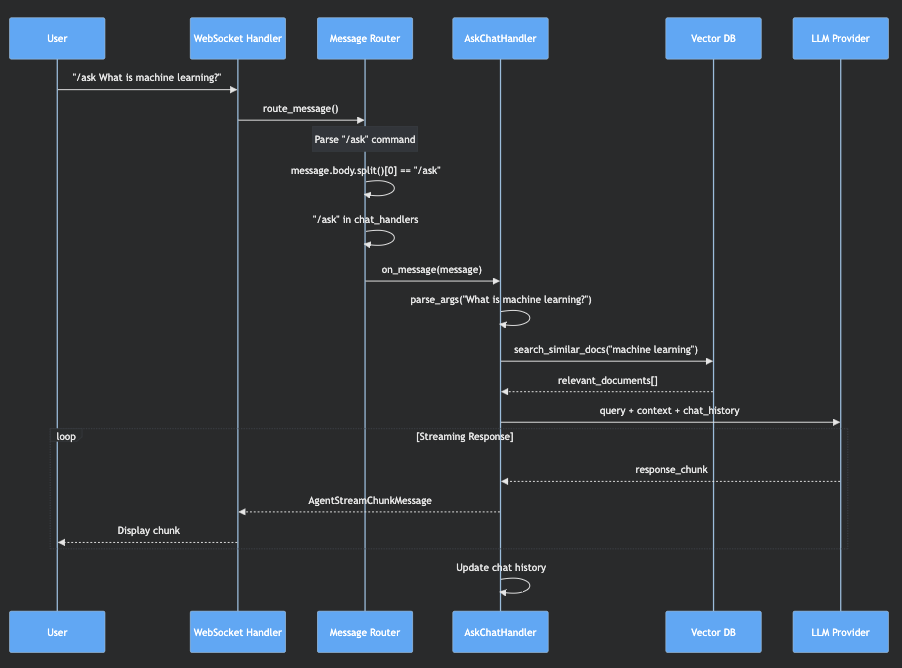

```python
class AskChatHandler(BaseChatHandler):
    id = "ask"
    name = "Ask with Local Data"
    help = "Ask a question about your learned data"
    routing_type = SlashCommandRoutingType(slash_id="ask")
    
    def __init__(self, *args, **kwargs):
        super().__init__(*args, **kwargs)
        self.parser.add_argument("query", nargs=argparse.REMAINDER)
        
    async def process_message(self, message: HumanChatMessage):
        # Uses ConversationalRetrievalChain for RAG
        # Searches learned documents + chat history
        # Streams response with context
```

```python
class GenerateChatHandler(BaseChatHandler):
    id = "generate"
    name = "Generate"
    help = "Generate a Jupyter notebook"
    routing_type = SlashCommandRoutingType(slash_id="generate")
    
    async def process_message(self, message: HumanChatMessage):
        # 1. Generate outline using LLM
        # 2. Fill sections with code/markdown
        # 3. Create .ipynb file
        # 4. Save to disk
```

```python
class LearnChatHandler(BaseChatHandler):
    id = "learn"
    name = "Learn Local Data"
    help = "Teach Jupyternaut about files on your system"
    routing_type = SlashCommandRoutingType(slash_id="learn")
    
    async def process_message(self, message: HumanChatMessage):
        # 1. Load documents from specified path
        # 2. Split into chunks
        # 3. Generate embeddings
        # 4. Store in FAISS vector database
```

```python
class AskChatHandler(BaseChatHandler):
    id = "ask"
    name = "Ask with Local Data"
    help = "Ask a question about your learned data"
    routing_type = SlashCommandRoutingType(slash_id="ask")
    
    def __init__(self, *args, **kwargs):
        super().__init__(*args, **kwargs)
        self.parser.add_argument("query", nargs=argparse.REMAINDER)
        
    async def process_message(self, message: HumanChatMessage):
        # Uses ConversationalRetrievalChain for RAG
        # Searches learned documents + chat history
        # Streams response with context
```

```python
class GenerateChatHandler(BaseChatHandler):
    id = "generate"
    name = "Generate"
    help = "Generate a Jupyter notebook"
    routing_type = SlashCommandRoutingType(slash_id="generate")
    
    async def process_message(self, message: HumanChatMessage):
        # 1. Generate outline using LLM
        # 2. Fill sections with code/markdown
        # 3. Create .ipynb file
        # 4. Save to disk
```

```python
class LearnChatHandler(BaseChatHandler):
    id = "learn"
    name = "Learn Local Data"
    help = "Teach Jupyternaut about files on your system"
    routing_type = SlashCommandRoutingType(slash_id="learn")
    
    async def process_message(self, message: HumanChatMessage):
        # 1. Load documents from specified path
        # 2. Split into chunks
        # 3. Generate embeddings
        # 4. Store in FAISS vector database
```

```python
class FixChatHandler(BaseChatHandler):
    id = "fix"
    name = "Fix"
    help = "Fix an error cell"
    routing_type = SlashCommandRoutingType(slash_id="fix")
    
    async def process_message(self, message: HumanChatMessage):
        # Requires cell with error selected
        # Analyzes error traceback + code
        # Suggests fixes
```

```python
# Users can type:
"/learn /path/to/docs --chunk-size 1000 --chunk-overlap 200"
"/generate Create a data analysis notebook --format python"
"/ask How do I use pandas? --verbose"

# Parsed using argparse:
class LearnChatHandler(BaseChatHandler):
    def __init__(self, *args, **kwargs):
        super().__init__(*args, **kwargs)
        
        self.parser.add_argument("path", nargs="?", help="Path to learn")
        self.parser.add_argument("--chunk-size", type=int, default=2000)
        self.parser.add_argument("--chunk-overlap", type=int, default=200)
        self.parser.add_argument("--delete", action="store_true")
        
    async def process_message(self, message: HumanChatMessage):
        args = self.parse_args(message)  # Parse command arguments
        path = args.path
        chunk_size = args.chunk_size
        # ... use parsed arguments
```

```python
# /help command shows all available commands
async def process_message(self, message: HumanChatMessage):
    # Auto-generates help from registered handlers
    commands_info = []
    for handler_id, handler in self.chat_handlers.items():
        if handler.routing_type.routing_method == "slash_command":
            commands_info.append({
                "command": f"/{handler.routing_type.slash_id}",
                "description": handler.help
            })
    
    help_text = self.format_help(commands_info)
    self.reply(help_text, message)
```

### **9. Extension Points**

The slash command system is **highly extensible**:

1. **Custom Commands**: Add new entry points in `pyproject.toml`
2. **Plugin Architecture**: Third parties can create custom handlers
3. **Argument Parsing**: Each command can define its own arguments
4. **Specialized Logic**: Each handler can have completely different behavior

### **10. Key Benefits**

✅ **Modular**: Each command is a separate handler
✅ **Extensible**: Easy to add new commands
✅ **Discoverable**: Auto-generated help and validation  
✅ **Consistent**: All commands share base functionality
✅ **Flexible**: Support for complex arguments and options

This slash command system is similar to **Discord bots** or **Slack commands** - providing a powerful, extensible way to add specialized AI functionality beyond basic chat!

What would you like to explore next? The key files and their roles would give you a deeper understanding of the codebase structure, or we can dive into the complete data flow!

---

**User**

next

---

**Cursor**

# Step 6: Key Files and Their Roles

Now let's walk through the most important files in the codebase and understand what each one does. This will give you a roadmap for contributing to the project.

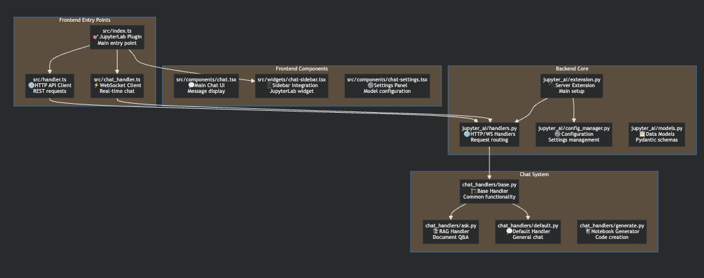

Let me examine each key file in detail:

Now let me examine some core component files:

Perfect! Now I can provide a comprehensive overview of the key files. Let me organize this by importance and functionality:

## 📁 Key Files and Their Roles

### **🎯 Frontend Entry Points**

#### **`src/index.ts`** - JupyterLab Plugin Entry Point
```typescript
// THE main frontend entry - registers the extension with JupyterLab
const plugin: JupyterFrontEndPlugin<IJaiCore> = {
  id: '@jupyter-ai/core:plugin',
  autoStart: true,
  activate: async (app: JupyterFrontEnd) => {
    // 1. Initialize WebSocket connection
    const chatHandler = new ChatHandler();
    await chatHandler.initialize();
    
    // 2. Create chat UI widget
    const chatWidget = buildChatSidebar(...);
    
    // 3. Add to JupyterLab sidebar
    app.shell.add(chatWidget, 'right');
    
    // 4. Register commands and menu items
    app.commands.addCommand('jupyter-ai:focus-chat-input', {...});
  }
};
```
**Role**: The "main()" function of the frontend - initializes everything

#### **`src/handler.ts`** - HTTP API Client
```typescript
// Makes REST API calls to backend
export async function requestAPI<T>(endPoint = '', init: RequestInit = {}): Promise<T> {
  const requestUrl = URLExt.join(settings.baseUrl, 'api/ai', endPoint);
  const response = await ServerConnection.makeRequest(requestUrl, init, settings);
  return await response.json();
}

// Usage:
const config = await requestAPI('config');           // GET /api/ai/config
const providers = await requestAPI('providers');     // GET /api/ai/providers
```
**Role**: HTTP client for configuration and metadata requests

#### **`src/chat_handler.ts`** - WebSocket Client
```typescript
export class ChatHandler implements IDisposable {
  private _socket: WebSocket | null = null;
  
  public async initialize(): Promise<void> {
    const url = new URL('/api/ai/chats', settings.wsUrl);
    this._socket = new WebSocket(url.href);
    
    this._socket.onmessage = event => {
      const message = JSON.parse(event.data);
      this._onMessage(message);  // Handle streaming responses
    };
  }
  
  public sendMessage(message: AiService.Request): Promise<string> {
    this._socket?.send(JSON.stringify(message));
  }
}
```
**Role**: WebSocket client for real-time chat communication

### **💬 Frontend UI Components**

#### **`src/components/chat.tsx`** - Main Chat Interface
```typescript
export function Chat(props: ChatProps) {
  const [showSettings, setShowSettings] = useState(false);
  const [messages, setMessages] = useState<AiService.ChatMessage[]>([]);
  
  return (
    <Box>
      {showSettings ? (
        <ChatSettings onClose={() => setShowSettings(false)} />
      ) : (
        <>
          <ChatMessages messages={messages} />
          <PendingMessages />
          <ChatInput onSend={handleSendMessage} />
        </>
      )}
    </Box>
  );
}
```
**Role**: Main chat UI component - orchestrates message display and input

#### **`src/widgets/chat-sidebar.tsx`** - JupyterLab Integration
```typescript
export function buildChatSidebar(...): ReactWidget {
  return ReactWidget.create(
    <UserContextProvider user={user}>
      <TelemetryContextProvider telemetryHandler={telemetryHandler}>
        <Chat
          chatHandler={chatHandler}
          selectionWatcher={selectionWatcher}
          // ... other props
        />
      </TelemetryContextProvider>
    </UserContextProvider>
  );
}
```
**Role**: Wraps chat UI as a JupyterLab widget for sidebar integration

### **🔌 Backend Core Files**

#### **`jupyter_ai/extension.py`** - Server Extension Entry Point
```python
class AiExtension(ExtensionApp):
    """Jupyter Server extension for AI functionality"""
    
    def initialize_handlers(self):
        # Register HTTP endpoints
        self.handlers.extend([
            (r"api/ai/config", GlobalConfigHandler),
            (r"api/ai/chats", RootChatHandler),  # WebSocket endpoint
            (r"api/ai/providers", ModelProviderHandler),
            (r"api/ai/slash-commands", SlashCommandsInfoHandler),
        ])
    
    def initialize_settings(self):
        # Initialize chat handlers
        self._init_chat_handlers()
        
        # Initialize shared state
        self.settings["chat_history"] = []
        self.settings["llm_chat_memory"] = BoundedChatHistory(k=2)
        self.settings["jai_config_manager"] = ConfigManager(...)
```
**Role**: Server extension entry point - initializes all backend services

#### **`jupyter_ai/handlers.py`** - HTTP & WebSocket Handlers
```python
class RootChatHandler(JupyterHandler, websocket.WebSocketHandler):
    """Main WebSocket handler for chat"""
    
    def open(self):
        """Handle WebSocket connection"""
        self.client_id = self.generate_client_id()
        self.write_message({"type": "connection", "client_id": self.client_id})
    
    def on_message(self, message):
        """Route incoming messages to appropriate handlers"""
        request = ChatRequest(**json.loads(message))
        chat_message = HumanChatMessage(...)
        
        # Route to slash command handler
        self.loop.create_task(self._route(chat_message))
    
    async def _route(self, message):
        """Parse slash commands and route to handlers"""
        maybe_command = message.body.split(None, 1)[0]
        is_command = message.body.startswith("/") and maybe_command in self.chat_handlers
        command = maybe_command if is_command else "default"
        
        await self.chat_handlers[command].on_message(message)
```
**Role**: HTTP API endpoints + WebSocket message routing

#### **`jupyter_ai/config_manager.py`** - Configuration Management
```python
class ConfigManager(Configurable):
    """Manages global configuration for Jupyter AI"""
    
    def __init__(self, lm_providers: LmProvidersDict, ...):
        self.lm_providers = lm_providers
        self.config_path = config_path or DEFAULT_CONFIG_PATH
        self._init_config()
    
    @property
    def lm_provider(self) -> Optional[BaseProvider]:
        """Get currently configured language model provider"""
        model_id = self._config.model_provider_id
        if not model_id:
            return None
        provider_id, local_model_id = model_id.split(":")
        provider_class = self.lm_providers[provider_id]
        return provider_class(**self.lm_provider_params)
    
    def update_config(self, request: UpdateConfigRequest):
        """Update configuration and validate"""
        self._config = GlobalConfig(**{**self._config.model_dump(), **request.model_dump()})
        self._write_config(self._config)
```
**Role**: Centralized configuration management for all AI settings

#### **`jupyter_ai/models.py`** - Data Models
```python
# Pydantic models for type safety and validation
class ChatRequest(BaseModel):
    prompt: str
    selection: Optional[Selection] = None

class HumanChatMessage(BaseModel):
    type: Literal["human"] = "human"
    id: str
    time: float
    body: str
    client: ChatClient

class AgentChatMessage(BaseModel):
    type: Literal["agent"] = "agent"
    id: str
    time: float
    body: str
    reply_to: str
    persona: Persona

class GlobalConfig(BaseModel):
    model_provider_id: Optional[str] = None
    embeddings_provider_id: Optional[str] = None
    api_keys: dict[str, str] = {}
    send_with_shift_enter: bool = False
```
**Role**: Type-safe data models for all messages and configurations

### **🎮 Chat Handler System**

#### **`chat_handlers/base.py`** - Base Handler Class
```python
class BaseChatHandler:
    """Base class for all chat command handlers"""
    
    # Handler metadata
    id: str = ""                    # e.g., "ask", "generate"
    name: str = ""                  # e.g., "Ask with Local Data"
    help: str = ""                  # Description for /help
    routing_type: HandlerRoutingType
    uses_llm: bool = False
    supports_help: bool = True
    
    def __init__(self, chat_history, llm_chat_memory, config_manager, **kwargs):
        # Shared state across all handlers
        self._chat_history = chat_history           # UI chat history
        self.llm_chat_memory = llm_chat_memory     # LLM conversation memory
        self.config_manager = config_manager        # Configuration access
        
        # Handler-specific LLM instance (cached and reused)
        self.llm: Optional[BaseProvider] = None
        self.llm_chain: Optional[Runnable] = None
    
    def get_llm_chain(self):
        """Get/create LLM chain with smart caching"""
        # Only recreate if model or parameters changed
        if self.model_changed() or self.params_changed():
            self.create_llm_chain(provider, params)
        return self.llm_chain
    
    async def process_message(self, message: HumanChatMessage):
        """Subclasses implement their specific logic"""
        raise NotImplementedError
```
**Role**: Common functionality for all slash commands

#### **`chat_handlers/ask.py`** - RAG Handler
```python
class AskChatHandler(BaseChatHandler):
    """Handles /ask command - RAG with learned documents"""
    
    id = "ask"
    routing_type = SlashCommandRoutingType(slash_id="ask")
    uses_llm = True
    
    def create_llm_chain(self, provider, provider_params):
        # Create RAG chain with learned documents
        memory = ConversationBufferWindowMemory(k=2)
        self.llm_chain = ConversationalRetrievalChain.from_llm(
            llm=self.llm,
            retriever=self.retriever,  # Vector search over learned docs
            memory=memory,
            condense_question_prompt=CONDENSE_PROMPT
        )
    
    async def process_message(self, message: HumanChatMessage):
        # Query learned documents + conversation context
        self.get_llm_chain()
        response = await self.llm_chain.ainvoke({
            "question": message.body,
            "chat_history": self.get_chat_history()
        })
        self.reply(response["answer"], message)
```
**Role**: RAG-based Q&A with learned documents

#### **`chat_handlers/generate.py`** - Notebook Generator
```python
class GenerateChatHandler(BaseChatHandler):
    """Handles /generate command - creates Jupyter notebooks"""
    
    id = "generate"
    routing_type = SlashCommandRoutingType(slash_id="generate")
    uses_llm = True
    
    async def process_message(self, message: HumanChatMessage):
        # Multi-step notebook generation
        prompt = message.body
        
        # 1. Generate outline
        outline = await generate_outline(prompt, llm=self.llm)
        
        # 2. Fill sections with code/markdown
        if self.llm.allows_concurrency:
            await afill_outline(outline, llm=self.llm)  # Parallel
        else:
            await fill_outline(outline, llm=self.llm)   # Sequential
        
        # 3. Create and save notebook
        notebook = create_notebook(outline)
        save_notebook(notebook, self.output_dir)
        
        self.reply(f"Notebook created: {notebook_path}", message)
```
**Role**: AI-powered Jupyter notebook generation

### **🧠 LLM Provider System**

#### **`jupyter-ai-magics/base_provider.py`** - Provider Base Class
```python
class BaseProvider:
    """Abstract base for all LLM providers"""
    
    id: str                    # e.g., "openai-chat"
    name: str                  # e.g., "OpenAI"
    models: list[str]         # e.g., ["gpt-4", "gpt-3.5-turbo"]
    model_id_key: str         # e.g., "model_name"
    pypi_package_deps: list   # Required Python packages
    auth_strategy: AuthStrategy
    
    def create_llm_chain(self) -> Runnable:
        """Create LangChain runnable for this provider"""
        prompt_template = self.get_chat_prompt_template()
        return prompt_template | self | StrOutputParser()
    
    @classmethod
    def is_api_key_exc(cls, e: Exception) -> bool:
        """Check if exception is API key error"""
        raise NotImplementedError
```
**Role**: Abstract interface for all LLM providers

#### **`jupyter-ai-magics/partner_providers/openai.py`** - OpenAI Implementation
```python
class ChatOpenAIProvider(BaseProvider, ChatOpenAI):
    """OpenAI implementation"""
    
    id = "openai-chat"
    name = "OpenAI"
    models = ["gpt-4", "gpt-4-turbo", "gpt-3.5-turbo", "gpt-4o"]
    auth_strategy = EnvAuthStrategy(name="OPENAI_API_KEY")
    
    @classmethod
    def is_api_key_exc(cls, e: Exception):
        return isinstance(e, openai.AuthenticationError)
```
**Role**: Concrete OpenAI provider implementation

## 🗺️ File Dependency Map

```typescript
// THE main frontend entry - registers the extension with JupyterLab
const plugin: JupyterFrontEndPlugin<IJaiCore> = {
  id: '@jupyter-ai/core:plugin',
  autoStart: true,
  activate: async (app: JupyterFrontEnd) => {
    // 1. Initialize WebSocket connection
    const chatHandler = new ChatHandler();
    await chatHandler.initialize();
    
    // 2. Create chat UI widget
    const chatWidget = buildChatSidebar(...);
    
    // 3. Add to JupyterLab sidebar
    app.shell.add(chatWidget, 'right');
    
    // 4. Register commands and menu items
    app.commands.addCommand('jupyter-ai:focus-chat-input', {...});
  }
};
```

```typescript
// Makes REST API calls to backend
export async function requestAPI<T>(endPoint = '', init: RequestInit = {}): Promise<T> {
  const requestUrl = URLExt.join(settings.baseUrl, 'api/ai', endPoint);
  const response = await ServerConnection.makeRequest(requestUrl, init, settings);
  return await response.json();
}

// Usage:
const config = await requestAPI('config');           // GET /api/ai/config
const providers = await requestAPI('providers');     // GET /api/ai/providers
```

```typescript
export class ChatHandler implements IDisposable {
  private _socket: WebSocket | null = null;
  
  public async initialize(): Promise<void> {
    const url = new URL('/api/ai/chats', settings.wsUrl);
    this._socket = new WebSocket(url.href);
    
    this._socket.onmessage = event => {
      const message = JSON.parse(event.data);
      this._onMessage(message);  // Handle streaming responses
    };
  }
  
  public sendMessage(message: AiService.Request): Promise<string> {
    this._socket?.send(JSON.stringify(message));
  }
}
```

```typescript
export function Chat(props: ChatProps) {
  const [showSettings, setShowSettings] = useState(false);
  const [messages, setMessages] = useState<AiService.ChatMessage[]>([]);
  
  return (
    <Box>
      {showSettings ? (
        <ChatSettings onClose={() => setShowSettings(false)} />
      ) : (
        <>
          <ChatMessages messages={messages} />
          <PendingMessages />
          <ChatInput onSend={handleSendMessage} />
        </>
      )}
    </Box>
  );
}
```

```typescript
export function buildChatSidebar(...): ReactWidget {
  return ReactWidget.create(
    <UserContextProvider user={user}>
      <TelemetryContextProvider telemetryHandler={telemetryHandler}>
        <Chat
          chatHandler={chatHandler}
          selectionWatcher={selectionWatcher}
          // ... other props
        />
      </TelemetryContextProvider>
    </UserContextProvider>
  );
}
```

```python
class AiExtension(ExtensionApp):
    """Jupyter Server extension for AI functionality"""
    
    def initialize_handlers(self):
        # Register HTTP endpoints
        self.handlers.extend([
            (r"api/ai/config", GlobalConfigHandler),
            (r"api/ai/chats", RootChatHandler),  # WebSocket endpoint
            (r"api/ai/providers", ModelProviderHandler),
            (r"api/ai/slash-commands", SlashCommandsInfoHandler),
        ])
    
    def initialize_settings(self):
        # Initialize chat handlers
        self._init_chat_handlers()
        
        # Initialize shared state
        self.settings["chat_history"] = []
        self.settings["llm_chat_memory"] = BoundedChatHistory(k=2)
        self.settings["jai_config_manager"] = ConfigManager(...)
```

```python
class RootChatHandler(JupyterHandler, websocket.WebSocketHandler):
    """Main WebSocket handler for chat"""
    
    def open(self):
        """Handle WebSocket connection"""
        self.client_id = self.generate_client_id()
        self.write_message({"type": "connection", "client_id": self.client_id})
    
    def on_message(self, message):
        """Route incoming messages to appropriate handlers"""
        request = ChatRequest(**json.loads(message))
        chat_message = HumanChatMessage(...)
        
        # Route to slash command handler
        self.loop.create_task(self._route(chat_message))
    
    async def _route(self, message):
        """Parse slash commands and route to handlers"""
        maybe_command = message.body.split(None, 1)[0]
        is_command = message.body.startswith("/") and maybe_command in self.chat_handlers
        command = maybe_command if is_command else "default"
        
        await self.chat_handlers[command].on_message(message)
```

```python
class ConfigManager(Configurable):
    """Manages global configuration for Jupyter AI"""
    
    def __init__(self, lm_providers: LmProvidersDict, ...):
        self.lm_providers = lm_providers
        self.config_path = config_path or DEFAULT_CONFIG_PATH
        self._init_config()
    
    @property
    def lm_provider(self) -> Optional[BaseProvider]:
        """Get currently configured language model provider"""
        model_id = self._config.model_provider_id
        if not model_id:
            return None
        provider_id, local_model_id = model_id.split(":")
        provider_class = self.lm_providers[provider_id]
        return provider_class(**self.lm_provider_params)
    
    def update_config(self, request: UpdateConfigRequest):
        """Update configuration and validate"""
        self._config = GlobalConfig(**{**self._config.model_dump(), **request.model_dump()})
        self._write_config(self._config)
```

```python
# Pydantic models for type safety and validation
class ChatRequest(BaseModel):
    prompt: str
    selection: Optional[Selection] = None

class HumanChatMessage(BaseModel):
    type: Literal["human"] = "human"
    id: str
    time: float
    body: str
    client: ChatClient

class AgentChatMessage(BaseModel):
    type: Literal["agent"] = "agent"
    id: str
    time: float
    body: str
    reply_to: str
    persona: Persona

class GlobalConfig(BaseModel):
    model_provider_id: Optional[str] = None
    embeddings_provider_id: Optional[str] = None
    api_keys: dict[str, str] = {}
    send_with_shift_enter: bool = False
```

```python
class BaseChatHandler:
    """Base class for all chat command handlers"""
    
    # Handler metadata
    id: str = ""                    # e.g., "ask", "generate"
    name: str = ""                  # e.g., "Ask with Local Data"
    help: str = ""                  # Description for /help
    routing_type: HandlerRoutingType
    uses_llm: bool = False
    supports_help: bool = True
    
    def __init__(self, chat_history, llm_chat_memory, config_manager, **kwargs):
        # Shared state across all handlers
        self._chat_history = chat_history           # UI chat history
        self.llm_chat_memory = llm_chat_memory     # LLM conversation memory
        self.config_manager = config_manager        # Configuration access
        
        # Handler-specific LLM instance (cached and reused)
        self.llm: Optional[BaseProvider] = None
        self.llm_chain: Optional[Runnable] = None
    
    def get_llm_chain(self):
        """Get/create LLM chain with smart caching"""
        # Only recreate if model or parameters changed
        if self.model_changed() or self.params_changed():
            self.create_llm_chain(provider, params)
        return self.llm_chain
    
    async def process_message(self, message: HumanChatMessage):
        """Subclasses implement their specific logic"""
        raise NotImplementedError
```

```python
class AskChatHandler(BaseChatHandler):
    """Handles /ask command - RAG with learned documents"""
    
    id = "ask"
    routing_type = SlashCommandRoutingType(slash_id="ask")
    uses_llm = True
    
    def create_llm_chain(self, provider, provider_params):
        # Create RAG chain with learned documents
        memory = ConversationBufferWindowMemory(k=2)
        self.llm_chain = ConversationalRetrievalChain.from_llm(
            llm=self.llm,
            retriever=self.retriever,  # Vector search over learned docs
            memory=memory,
            condense_question_prompt=CONDENSE_PROMPT
        )
    
    async def process_message(self, message: HumanChatMessage):
        # Query learned documents + conversation context
        self.get_llm_chain()
        response = await self.llm_chain.ainvoke({
            "question": message.body,
            "chat_history": self.get_chat_history()
        })
        self.reply(response["answer"], message)
```

```python
class GenerateChatHandler(BaseChatHandler):
    """Handles /generate command - creates Jupyter notebooks"""
    
    id = "generate"
    routing_type = SlashCommandRoutingType(slash_id="generate")
    uses_llm = True
    
    async def process_message(self, message: HumanChatMessage):
        # Multi-step notebook generation
        prompt = message.body
        
        # 1. Generate outline
        outline = await generate_outline(prompt, llm=self.llm)
        
        # 2. Fill sections with code/markdown
        if self.llm.allows_concurrency:
            await afill_outline(outline, llm=self.llm)  # Parallel
        else:
            await fill_outline(outline, llm=self.llm)   # Sequential
        
        # 3. Create and save notebook
        notebook = create_notebook(outline)
        save_notebook(notebook, self.output_dir)
        
        self.reply(f"Notebook created: {notebook_path}", message)
```

```python
class BaseProvider:
    """Abstract base for all LLM providers"""
    
    id: str                    # e.g., "openai-chat"
    name: str                  # e.g., "OpenAI"
    models: list[str]         # e.g., ["gpt-4", "gpt-3.5-turbo"]
    model_id_key: str         # e.g., "model_name"
    pypi_package_deps: list   # Required Python packages
    auth_strategy: AuthStrategy
    
    def create_llm_chain(self) -> Runnable:
        """Create LangChain runnable for this provider"""
        prompt_template = self.get_chat_prompt_template()
        return prompt_template | self | StrOutputParser()
    
    @classmethod
    def is_api_key_exc(cls, e: Exception) -> bool:
        """Check if exception is API key error"""
        raise NotImplementedError
```

```python
class ChatOpenAIProvider(BaseProvider, ChatOpenAI):
    """OpenAI implementation"""
    
    id = "openai-chat"
    name = "OpenAI"
    models = ["gpt-4", "gpt-4-turbo", "gpt-3.5-turbo", "gpt-4o"]
    auth_strategy = EnvAuthStrategy(name="OPENAI_API_KEY")
    
    @classmethod
    def is_api_key_exc(cls, e: Exception):
        return isinstance(e, openai.AuthenticationError)
```

## 🎯 Where to Start Contributing

Based on file importance and complexity:

**🟢 Beginner-Friendly:**
- `models.py` - Add new data models
- `chat_handlers/*.py` - Create new slash commands
- `src/components/` - UI improvements

**🟡 Intermediate:**
- `config_manager.py` - Configuration features
- `handlers.py` - API endpoints
- `base_provider.py` - Provider enhancements

**🔴 Advanced:**
- `extension.py` - Core system changes
- `chat_handler.ts` - WebSocket logic
- `index.ts` - JupyterLab integration

This file map gives you a clear understanding of where different functionality lives and how pieces connect together. Each file has a specific, well-defined responsibility!

What would you like to explore next? The complete data flow would show you how everything works together, or we can dive into the configuration system!

